# Smart Trader — Complete Architecture Diagrams

> Visualize the entire codebase: system layers, data flow, broker adapters, strategy engine, API routes, and frontend structure.

---

## 1. High-Level System Architecture

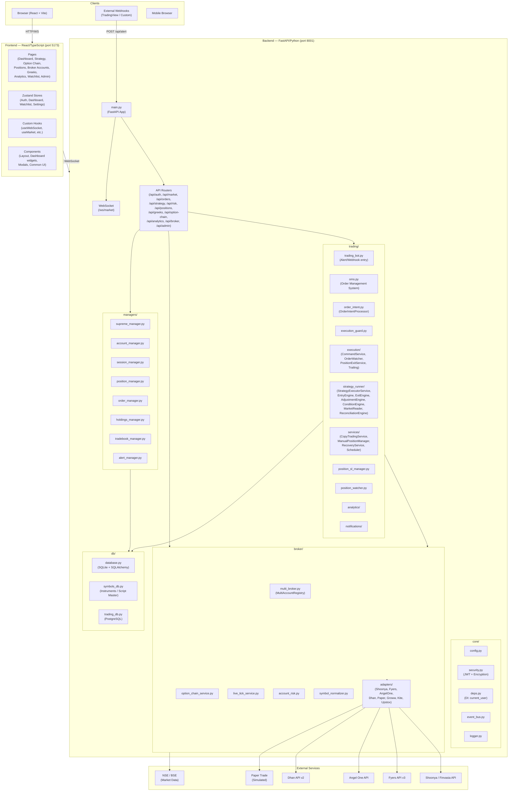

---

## 2. Backend Module Dependency Map

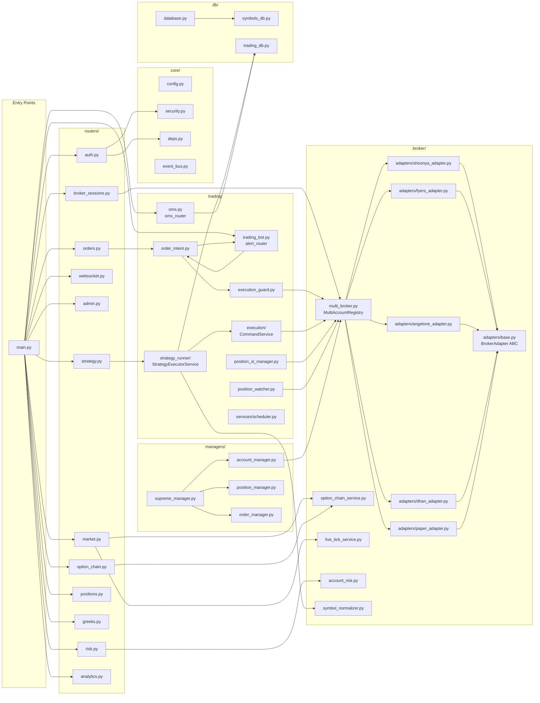

---

## 3. Broker Adapter Layer

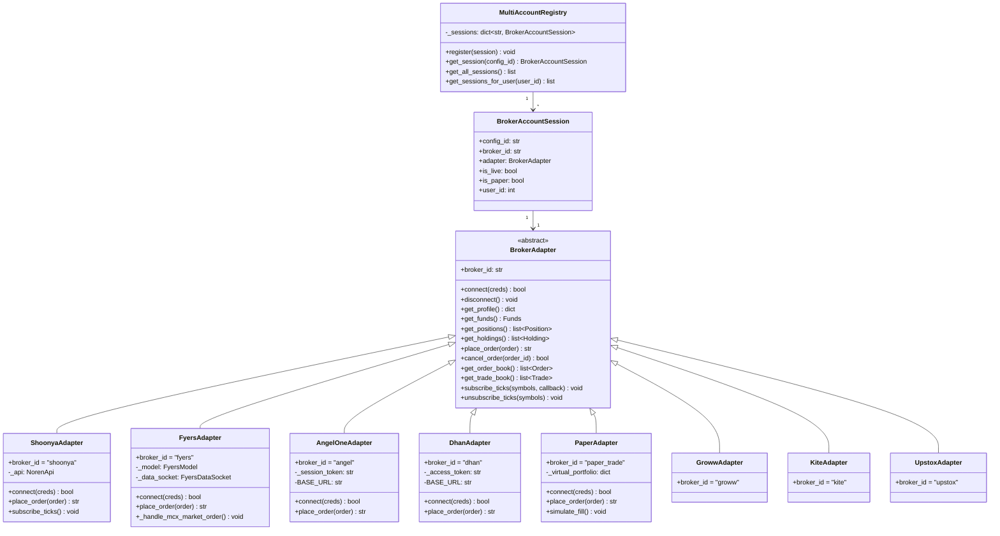

---

## 4. Order Flow — Complete Pipeline

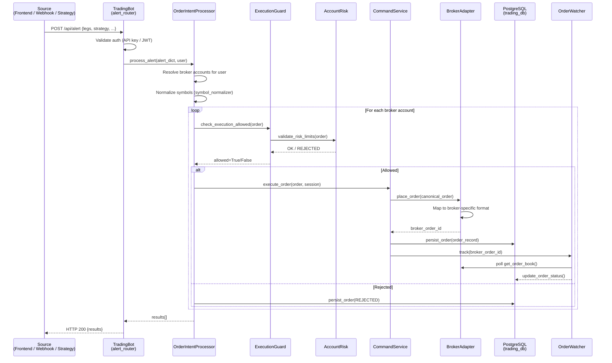

---

## 5. Strategy Runner — Execution Flow

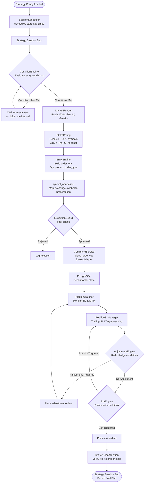

---

## 6. API Routes Map

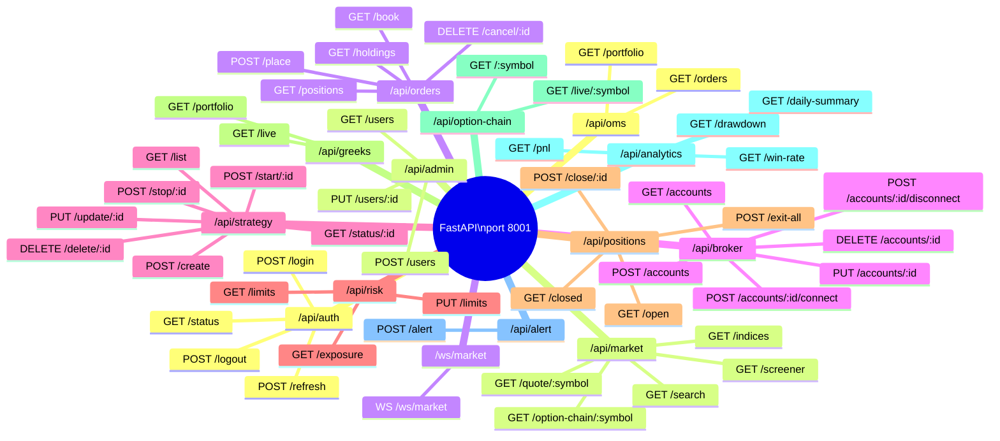

---

## 7. Frontend Architecture

```mermaid
graph TB
    subgraph APP["App.tsx — React Router"]
        LANDING["/ LandingPage"]
        LOGIN["/ LoginPage"]
        ADMIN_LOGIN["/admin/login AdminLoginPage"]
        ADMIN["/admin AdminPage"]
        DASH["/dashboard DashboardPage"]
        BROKER["/broker-accounts BrokerAccountsPage"]
        MARKET["/market MarketPage"]
        OPTION["/option-chain OptionChainPage"]
        STRAT["/strategy StrategyPage"]
        STRAT_BUILD["/strategy/builder StrategyBuilderPage"]
        POS["/positions PositionManagerPage"]
        GREEK["/greeks GreeksDashboardPage"]
        ANALYTICS["/analytics HistoricalAnalyticsPage"]
        WATCHLIST["/watchlist WatchlistChartPage"]
        SETTINGS["/settings SettingsPage"]
    end

    subgraph STORES["Zustand Stores (stores/index.ts)"]
        AUTH_ST["useAuthStore\n(user, accounts, isAuthenticated,\nactiveAccountId)"]
        DASH_ST["useDashboardStore\n(positions, orders, pnl)"]
        WATCH_ST["useWatchlistStore\n(watchlists, items)"]
        SETTINGS_ST["useSettingsStore\n(theme, layout, prefs)"]
        TOAST_ST["useToastStore\n(notifications queue)"]
    end

    subgraph HOOKS["Custom Hooks (hooks/)"]
        USE_WS["useWebSocket\n(live tick stream)"]
        USE_MKT["useMarketData\n(quotes, indices)"]
        USE_AUTH["useAuth\n(login/logout flow)"]
        USE_BROKER["useBrokerAccounts"]
    end

    subgraph COMPONENTS["Components (components/)"]
        LAYOUT["layout/\n(Navbar, Sidebar, Footer)"]
        DASH_COMP["dashboard/\n(PnlCard, PositionTable,\nOrderBook, RiskMeter)"]
        COMMON["common/\n(Button, Modal, Table,\nToast, Spinner, Chart)"]
        MODALS["modals/\n(PlaceOrderModal,\nBrokerConnectModal)"]
    end

    subgraph APIS["API Layer (lib/)"]
        APICLIENT["api.ts\n(axios instance + interceptors)"]
        WS_CLIENT["websocket.ts\n(ReconnectingWebSocket)"]
    end

    DASH --> DASH_ST
    DASH --> DASH_COMP
    BROKER --> AUTH_ST
    STRAT --> STORES
    OPTION --> USE_WS
    MARKET --> USE_MKT

    HOOKS --> APICLIENT
    HOOKS --> WS_CLIENT
    COMPONENTS --> STORES
    APICLIENT -->|REST| FASTAPI_BACK["FastAPI Backend\n:8001"]
    WS_CLIENT -->|WebSocket| FASTAPI_BACK
```

---

## 8. Database Layer

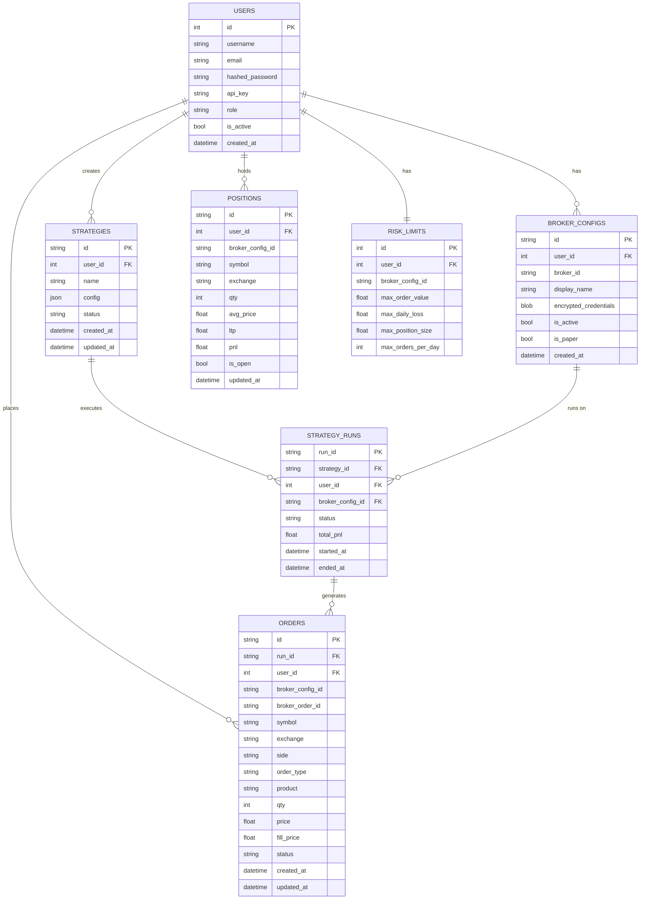

---

## 9. WebSocket / Live Data Flow

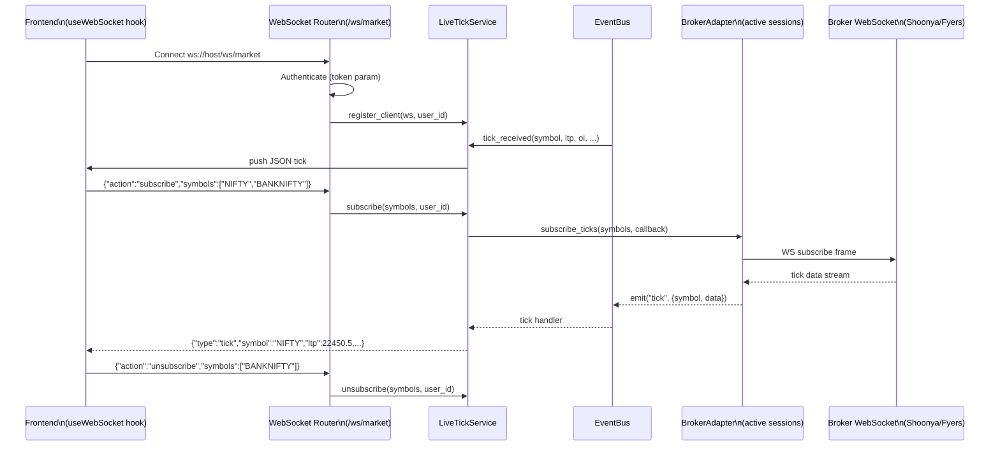

---

## 10. Authentication & Security Flow

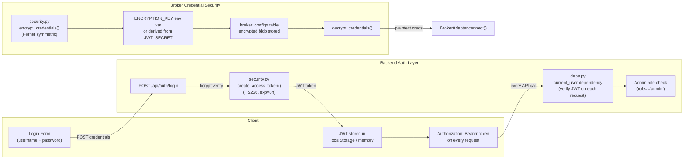

---

## 11. Strategy Runner — Internal Modules

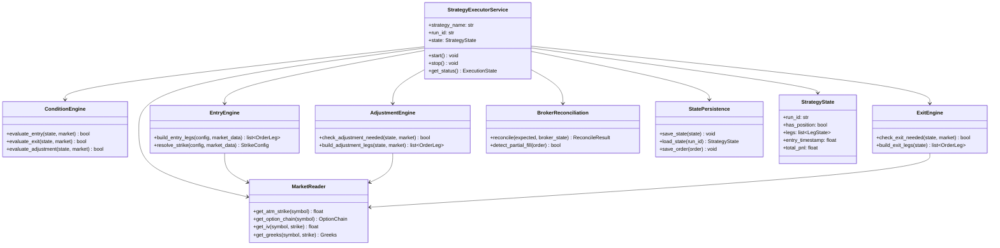

---

## 12. Component & Module Count Summary

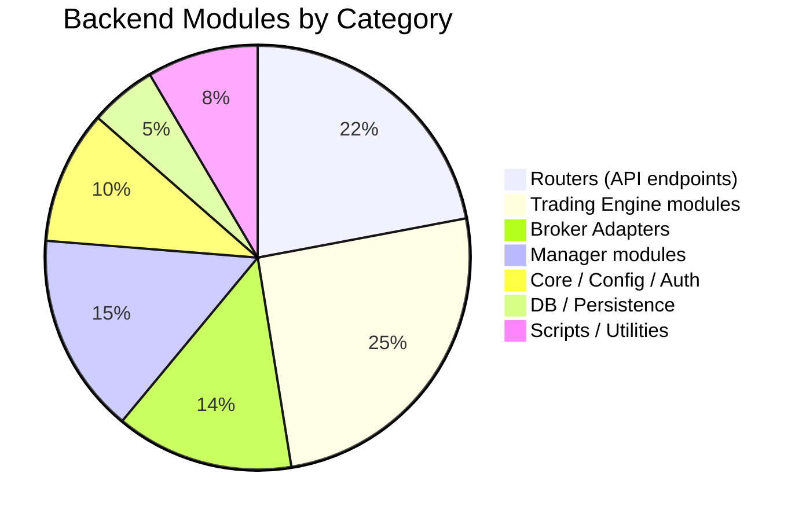

---

## Quick Reference: Key File Paths

| Layer | File | Purpose |
|-------|------|---------|
| Entry | `backend/main.py` | FastAPI app, router registration, startup |
| Auth | `backend/core/security.py` | JWT creation/verify, credential encryption |
| DI | `backend/core/deps.py` | `current_user` FastAPI dependency |
| Config | `backend/core/config.py` | All env vars + feature flags |
| Orders | `backend/trading/trading_bot.py` | Single checkpoint for ALL orders |
| OMS | `backend/trading/oms.py` | Order lifecycle & portfolio state |
| Intent | `backend/trading/order_intent.py` | Multi-account order routing |
| Guard | `backend/trading/execution_guard.py` | Pre-trade risk validation |
| Broker | `backend/broker/multi_broker.py` | MultiAccountRegistry |
| Base | `backend/broker/adapters/base.py` | BrokerAdapter ABC |
| Strategy | `backend/trading/strategy_runner/strategy_executor_service.py` | Strategy run loop |
| DB | `backend/db/database.py` | SQLite tables (users, configs) |
| DB | `backend/db/trading_db.py` | PostgreSQL (orders, positions, runs) |
| Frontend | `frontend/src/App.tsx` | React router + page layout |
| Stores | `frontend/src/stores/index.ts` | Zustand global state |
